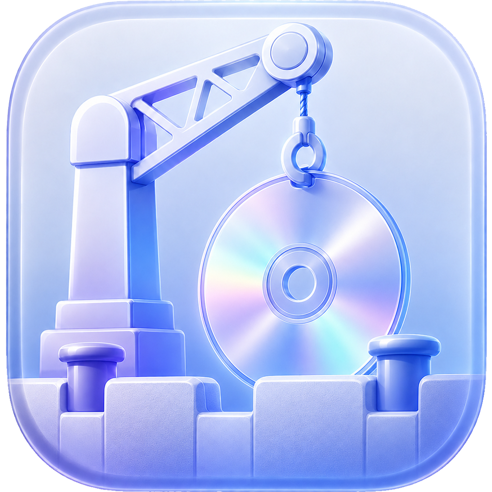

<p align="center">
  
</p>

<h1 align="center">MediaDock</h1>

## 한국어

MediaDock은 사용자가 제공한 URL을 yt-dlp에 전달하고,
번들로 포함된 최소 구성의 FFmpeg 빌드를 사용해 오디오 또는 비디오를 추출하는
개인용 macOS 유틸리티입니다.

MediaDock은 YouTube와 제휴되어 있지 않으며, YouTube의 보증을 받지 않습니다.
본인이 소유한 콘텐츠, 퍼블릭 도메인 콘텐츠, 또는 다운로드 권한이 있는 콘텐츠에만 사용하세요.
관련 법률 및 서비스 약관을 준수할 책임은 사용자에게 있습니다.

### 사용자용

요구 사항:

- macOS 11.0 이상을 실행하는 Apple Silicon Mac
- Xcode 또는 Command Line Tools는 필요하지 않습니다.
- Homebrew, FFmpeg, yt-dlp를 별도로 설치할 필요가 없습니다.

GitHub Releases에서 `MediaDock.dmg`를 다운로드한 뒤, DMG를 열고
`MediaDock.app`을 Applications 폴더로 옮겨 실행하세요.

배포용 앱에는 `yt-dlp`, `ffmpeg`, `ffprobe`가 함께 포함되어 있습니다.
앱 실행 시 FFmpeg를 자동으로 빌드하거나 설치하지 않습니다.

### 소스에서 빌드

이 저장소는 제3자 실행 바이너리를 Git에 포함하지 않습니다.
따라서 저장소를 클론한 직후에는 다음 파일이 없습니다.

- `youtube-downloader/yt-exec/yt-dlp`
- `youtube-downloader/ffmpeg-exec/ffmpeg`
- `youtube-downloader/ffmpeg-exec/ffprobe`

소스에서 직접 빌드하려면 아래 절차로 번들 실행 파일을 먼저 준비해야 합니다.

요구 사항:

- macOS 11.0 이상을 실행하는 Apple Silicon Mac
- Xcode
- Command Line Tools

1. 공식 yt-dlp macOS 실행 파일을 다운로드합니다.

```sh
yt_dlp_version="2026.03.17"
mkdir -p youtube-downloader/yt-exec .build/third-party-sources

curl --fail --location --retry 3 \
  "https://github.com/yt-dlp/yt-dlp/releases/download/${yt_dlp_version}/yt-dlp_macos" \
  --output youtube-downloader/yt-exec/yt-dlp

curl --fail --location --retry 3 \
  "https://github.com/yt-dlp/yt-dlp/releases/download/${yt_dlp_version}/SHA2-256SUMS" \
  --output .build/third-party-sources/SHA2-256SUMS

expected_hash="$(grep ' yt-dlp_macos$' .build/third-party-sources/SHA2-256SUMS | awk '{ print $1 }')"
actual_hash="$(shasum -a 256 youtube-downloader/yt-exec/yt-dlp | awk '{ print $1 }')"
test "$actual_hash" = "$expected_hash"

chmod 755 youtube-downloader/yt-exec/yt-dlp
```

2. 최소 구성의 FFmpeg 및 FFprobe 바이너리를 생성합니다.

```sh
scripts/build-minimal-ffmpeg.sh
```

이 스크립트는 FFmpeg 8.1.2 및 LAME 3.100 소스 아카이브를 다운로드하고,
SHA-256 체크섬을 검증한 뒤, GPL 또는 nonfree FFmpeg 구성 요소 없이
arm64 정적 바이너리를 생성합니다.

3. `youtube-downloader.xcodeproj`를 Xcode에서 열고 MediaDock 제품을 빌드합니다.

빌드 전 최종적으로 아래 파일이 존재해야 합니다.

- `youtube-downloader/yt-exec/yt-dlp`
- `youtube-downloader/ffmpeg-exec/ffmpeg`
- `youtube-downloader/ffmpeg-exec/ffprobe`

### GitHub 릴리스 체크리스트

바이너리 재배포에는 README 고지만으로 충분하지 않습니다. 각 릴리스에는
다음 자산이 모두 포함되어야 합니다.

- `MediaDock.dmg`
- 해당 태그와 일치하는 MediaDock 소스
- 번들된 바이너리에 정확히 대응하는 yt-dlp, FFmpeg, LAME 소스를 포함한
  제3자 소스 아카이브
- 적용 가능한 모든 라이선스 및 제3자 고지 파일

릴리스 설명에는 위 소스 및 라이선스 자산으로 직접 연결되는 링크를 포함해야 합니다.
업스트림 URL에만 의존하지 말고, 바이너리 릴리스와 정확히 대응하는 소스를 함께 보관하세요.

제3자 소스 아카이브는 다음 명령으로 생성할 수 있습니다.

```sh
scripts/package-third-party-sources.sh
```

DMG를 업로드하기 전에 Developer ID로 서명하고, 최종 배포본을 공증한 뒤,
공증 티켓을 스테이플링하고 Gatekeeper로 검증하세요.

### 제3자 소프트웨어

- yt-dlp 2026.03.17 — PyInstaller 결합 저작물은 GPL-3.0-or-later
- FFmpeg 8.1.2 최소 빌드 — LGPL-2.1-or-later
- LAME 3.100 — LGPL-2.0-or-later

자세한 내용은 `youtube-downloader/ThirdPartyNotices.md`와
애플리케이션 번들에 포함된 라이선스 파일을 참고하세요.

### 라이선스

MediaDock은 GNU General Public License 버전 3 이상에 따라 라이선스가 부여됩니다.
자세한 내용은 [LICENSE](LICENSE)를 참고하세요.


---

## English

MediaDock is a personal macOS utility that passes user-provided URLs to yt-dlp
and extracts audio or video with a bundled minimal FFmpeg build.

MediaDock is not affiliated with or endorsed by YouTube. Use it only for content
you own, content in the public domain, or content you are authorized to download.
You are responsible for complying with applicable law and service terms.

## For Users

Requirements:

- Apple Silicon Mac running macOS 11.0 or later
- Xcode or Command Line Tools are not required.
- Homebrew, FFmpeg, and yt-dlp do not need to be installed separately.

Download `MediaDock.dmg` from GitHub Releases, open the DMG, and move
`MediaDock.app` to the Applications folder.

The distributed app already includes `yt-dlp`, `ffmpeg`, and `ffprobe`.
The app does not build or install FFmpeg automatically at launch.

## Build from Source

This repository intentionally does not track third-party executable binaries in
Git in order to keep the source repository smaller and reproducible. A fresh
clone does not include these files:

- `youtube-downloader/yt-exec/yt-dlp`
- `youtube-downloader/ffmpeg-exec/ffmpeg`
- `youtube-downloader/ffmpeg-exec/ffprobe`

To build from source, prepare the bundled executables first.

Requirements:

- Apple Silicon Mac running macOS 11.0 or later
- Xcode
- Command Line Tools

1. Download the official yt-dlp macOS executable.

```sh
yt_dlp_version="2026.03.17"
mkdir -p youtube-downloader/yt-exec .build/third-party-sources

curl --fail --location --retry 3 \
  "https://github.com/yt-dlp/yt-dlp/releases/download/${yt_dlp_version}/yt-dlp_macos" \
  --output youtube-downloader/yt-exec/yt-dlp

curl --fail --location --retry 3 \
  "https://github.com/yt-dlp/yt-dlp/releases/download/${yt_dlp_version}/SHA2-256SUMS" \
  --output .build/third-party-sources/SHA2-256SUMS

expected_hash="$(grep ' yt-dlp_macos$' .build/third-party-sources/SHA2-256SUMS | awk '{ print $1 }')"
actual_hash="$(shasum -a 256 youtube-downloader/yt-exec/yt-dlp | awk '{ print $1 }')"
test "$actual_hash" = "$expected_hash"

chmod 755 youtube-downloader/yt-exec/yt-dlp
```

2. Generate the minimal FFmpeg and FFprobe binaries.

```sh
scripts/build-minimal-ffmpeg.sh
```

The script downloads FFmpeg 8.1.2 and LAME 3.100 source archives, verifies their
SHA-256 checksums, and creates arm64 static binaries without GPL or nonfree FFmpeg
components.

3. Open `youtube-downloader.xcodeproj` in Xcode and build the MediaDock product.

Before building, these files must exist:

- `youtube-downloader/yt-exec/yt-dlp`
- `youtube-downloader/ffmpeg-exec/ffmpeg`
- `youtube-downloader/ffmpeg-exec/ffprobe`

## GitHub Release checklist

A README notice alone is not sufficient for binary redistribution. Each release
should include all of the following assets:

- `MediaDock.dmg`
- the MediaDock source for the matching tag
- a third-party source archive containing the exact yt-dlp, FFmpeg, and LAME
  sources corresponding to the bundled binaries
- all applicable license and third-party notice files

The release description should link directly to those source and license assets.
Do not rely only on upstream URLs: retain the exact corresponding source with the
binary release.

Create the third-party source archive with:

```sh
scripts/package-third-party-sources.sh
```

Before uploading the DMG, sign with Developer ID, notarize the final distribution,
staple the notarization ticket, and verify it with Gatekeeper.

## Third-party software

- yt-dlp 2026.03.17 — the PyInstaller combined work is GPL-3.0-or-later
- FFmpeg 8.1.2 minimal build — LGPL-2.1-or-later
- LAME 3.100 — LGPL-2.0-or-later

See `youtube-downloader/ThirdPartyNotices.md` and the license files included in the
application bundle.

## License

MediaDock is licensed under the GNU General Public License version 3 or later.
See [LICENSE](LICENSE).
